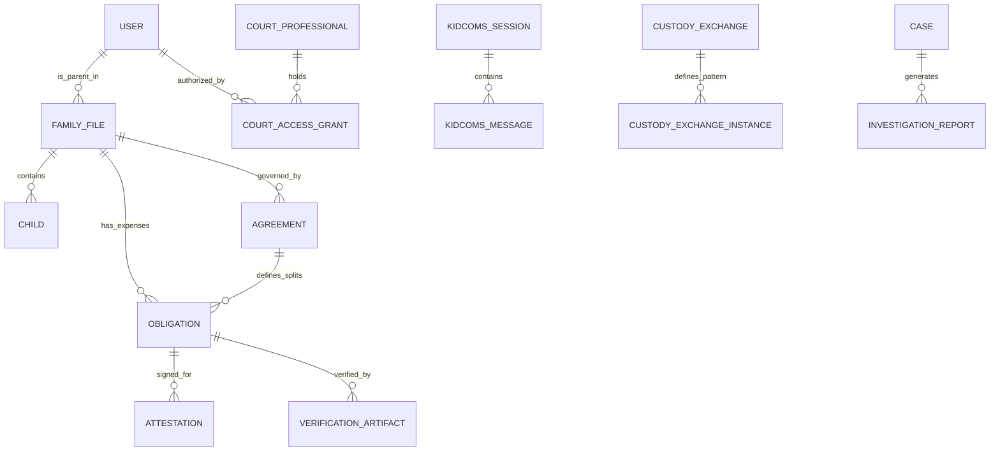

# CommonGround Database Encyclopedia (Data Scheme)

This document is the exhaustive technical source of truth for the CommonGround data architecture. It "over-explains" every entity, field significance, and inter-relationship that powers our "Sanctuary of Truth."

---

## 🏛️ Domain 1: Identity & Access Management
The foundation of who can see what and how they are authenticated.

### 👤 `User` table
The primary entity for parents on the platform.
- **Fields**: `email`, `password_hash`, `full_name`, `phone`, `role` (parent, admin), `is_active`.
- **Relationships**: Owns `FamilyFile` and `Subscription`. Linked to `Activity` logs.

### 🏛️ `CourtProfessional` table
Verified legal professionals (Attorneys, GALs, Mediators).
- **Over-Explanation**: These are distinct from Parents. They have `role` (judge, mediator, gal) and `credentials` (bar number). They enter the platform via `CourtAccessGrant`.
- **Integrity**: `is_verified` and `verified_at` track the manual approval of their legal status.

---

## 📁 Domain 2: The Core Container (Family File)

### 📂 `FamilyFile` table
The "Unified Digital Life" for a co-parenting pair.
- **Over-Explanation**: All child data, agreements, and message history are scoped to a `FamilyFile`. It acts as the multi-tenant boundary.
- **Fields**: `petitioner_id`, `respondent_id`, `file_number`, `status` (active, archived).
- **Consensus**: Most changes within a `FamilyFile` require dual-parent approval via a `ConsensusRecord`.

---

## 🛡️ Domain 3: Safety & Communication (KidComs & ARIA)

### 🎥 `KidComsSession` table
Tracks a live video, game, or theater session.
- **Fields**: `daily_room_url` (Daily.co integration), `session_type` (arcade, theater, whiteboard), `status` (ringing, active, missed).
- **Participants**: Stored in a JSON array to track joined/left timestamps for all parties (Parent, Child, Circle Contact).

### 💬 `Message` and `KidComsMessage` tables
- **ARIA Integration**: Every message has `aria_analyzed` (bool), `aria_flagged` (bool), and `aria_score`.
- **Redaction Logic**: `original_content` vs. `content`. If ARIA suggests a rewrite and the parent accepts/forced, the safe version is stored in `content`, while the legal record preserves `original_content` for professional review.

---

## 💰 Domain 4: Financial Integrity (ClearFund™)

### 💸 `Obligation` table
The core of child support and expense sharing.
- **Logic**: An obligation is "Purpose-Locked."
- **Fields**: `purpose_category` (medical, sports), `total_amount`, `petitioner_share`, `respondent_share`.
- **Verification**: `amount_funded` vs. `amount_spent` vs. `amount_verified`.

### ⚖️ `Attestation` table
- **Over-Explanation**: When a parent requests money, they must sign a digital `Attestation`.
- **Fields**: `attestation_text`, `ip_address`, `user_agent`. This creates a court-ready record of the "Sworn Statement" that the funds will be used correctly.

---

## 🧭 Domain 5: Logistics & Silent Handoff™

### 🔄 `CustodyExchange` and `Instance` tables
- **Silent Handoff**: Fields like `location_lat`, `location_lng`, and `geofence_radius_meters`.
- **The "Truth" Mechanism**: `from_parent_in_geofence` and `to_parent_in_geofence` (bools) are automatically set by GPS. `qr_confirmed_at` provides a mutual, high-integrity "handshake" timestamp.

---

## ⚖️ Domain 6: Agreements & Orders

### 📜 `Agreement` and `CustodyOrder` tables
- **SCA (SharedCare Agreement)**: The living digital contract.
- **18 Sections**: Mapped via JSON structures or linked `AgreementSection` records.
- **Activation**: `AgreementActivation` table tracks the dual-parent digital signatures (digital fingerprint) and the `activated_at` timestamp that locks the version.

---

## 📄 Domain 7: The Reporting Engine (Exports)

### 📊 `Export` and `InvestigationReport` tables
- **Parental Reports**: Created in `Export`, usually limited to 30 days of history.
- **Professional Reports**: Created in `InvestigationReport`. Includes `content_hash` (SHA-256) and `watermark_text` for legal chain of custody.
- **Metadata**: Tracks `download_count` and `last_downloaded_at`.

---

## 📈 ER Relationship Summary

---

## 🔧 Technical Invariants for Engineers

1.  **UUIDs Everywhere**: All primary keys are `UUID4` (String 36).
2.  **UTC Only**: All `DateTime` fields are stored in UTC.
3.  **Soft Deletes**: Most tables use `is_active` to preserve legal history.
4.  **Immutability**: Tables ending in `_log`, `_instance`, or `_activation` are "Append-Only" to ensure court integrity.
